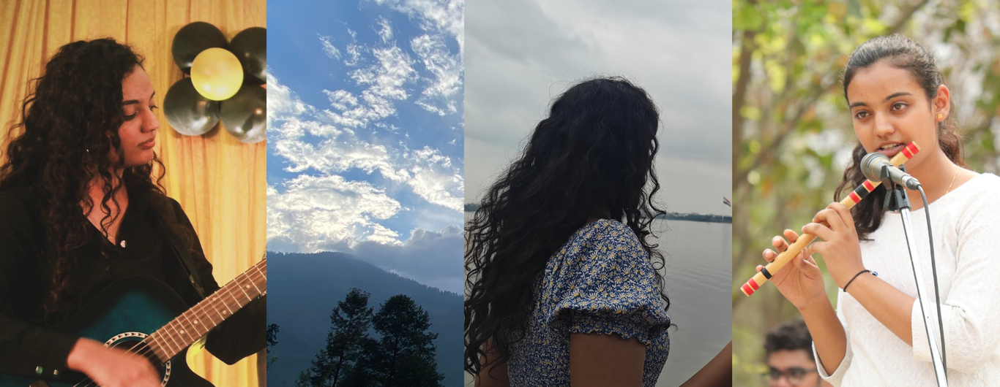

  

<h1 style="text-align: center; font-weight: 800; font-size: 2.8rem; letter-spacing: 1.5px; margin-bottom: 6px;">ANGEL VYAS</h1>
<h4 style="text-align: center; font-weight: 500; font-size: 1.1rem; margin-top: 0;">
  Data Science Student • Aspiring Developer • Problem Solver
</h4>

  📍 Hyderabad | 📧 <a href="mailto:angelvyaas@gmail.com">angelvyaas@gmail.com</a> | 🌐 <a href="https://angelvyas.com">angelvyas.com</a>

<h2>👋 About Me</h2>

I am a <strong>Data Science</strong> undergraduate passionate about exploring artificial intelligence, large language models (LLMs), and data-driven innovation.I enjoy building and contributing to real-world projects, collaborating on my personal website, and applying creative problem-solving to technical challenges.I bring strong <strong>leadership</strong>, communication, and organizational skills to every project I undertake.
I am open to opportunities in AI, data science, and related fields, and I’m committed to continuous learning and professional growth.

<h2>🛠 Skills</h2>
<ul>
<li>C language</li>
<li>Git & GitHub</li>
<li>Docker</li>
<li>Linux</li>
<li>Markdown</li>
<li>HTML</li>
<li>Tableau</li>
</ul>

<h2>🎓 Education</h2>
<ul>
<li><strong>B-Tech in Computer Science(Data Science)</strong>, MAHATMA GANDHI INSTITUTE OF TECHNOLOGY,
HYDERABAD — 2023 - 2027</li>
 
<li><strong>Intermediate</strong>, MAHESHWARI GIRLS PUBLIC SCHOOL, JAIPUR — 2012 - 2022</li>
</ul>

<h2>📂 Projects</h2>

<h3>🚀 <a href="#">My Website</a></h3>

A modern and responsive portfolio to showcase my projects and skills using.

<h2>📫 Contact</h2>
<ul>
<li>📧 Email: <a href="https://mail.google.com/mail/?view=cm&to=angelvyaas@gmail.com" target="_blank">angelvyaas@gmail.com</a></li>
<li>🐙 GitHub: <a href="https://github.com/angelvyas">github.com/angelvyas</a></li>
<li>💼 LinkedIn: <a href="https://linkedin.com/in/angelvyas">linkedin.com/in/angelvyas</a></li>
<li>🌐 Website: <a href="https://angelvyas.com">angelvyas.com</a></li>
</ul>

<h2>🎯 Interests</h2>
<ul>
<li>Open Source Contribution</li>
<li>Artificial Intelligence & Large Language Models (LLMs)</li>
<li>Full-Stack Web Development</li>
<li>Data Visualization & Analytics</li>
<li>Music & Playing Instruments</li>
<li>Event Planning & Organization</li>
<li>Travel & Culture</li>
</ul>

